# Context Layering Architecture

pytest-httpchain uses Python's `ChainMap` to manage variable scoping across scenario execution. Understanding this layering helps debug variable resolution issues and design complex test scenarios.

## Context Hierarchy

Variables are resolved through a layered context system. When you reference `{{ variable }}`, the system searches layers from top to bottom:

```mermaid
flowchart TB
    subgraph lookup["Variable Lookup Order"]
        direction TB
        iter["🔄 Iteration Variables<br/><small>(parallel execution)</small>"]
        saves["💾 Response Saves<br/><small>(current stage)</small>"]
        stage_sub["📝 Stage Substitutions"]
        fixtures["🔧 Stage Fixtures"]
        global["🌐 Global Context<br/><small>(previous saves)</small>"]
        scenario["📋 Scenario Substitutions"]

        iter --> saves --> stage_sub --> fixtures --> global --> scenario
    end

    style iter fill:#e1f5fe
    style saves fill:#e8f5e9
    style stage_sub fill:#fff3e0
    style fixtures fill:#fce4ec
    style global fill:#f3e5f5
    style scenario fill:#eceff1
```



**Highest priority** → Iteration Variables (checked first)
**Lowest priority** → Scenario Substitutions (checked last)

## How ChainMap Works

A `ChainMap` groups multiple dictionaries and searches them as one. The first match wins:

```python
from collections import ChainMap

base = {"url": "https://api.example.com", "timeout": 30}
stage = {"timeout": 10}  # Override
context = ChainMap(stage, base)

context["url"]      # "https://api.example.com" (from base)
context["timeout"]  # 10 (from stage, shadows base)
```

## Execution Flow

### 1. Scenario Initialization

When a test scenario starts, the global context is initialized with scenario-level substitutions:

```json
{
    "substitutions": [
        {"vars": {"base_url": "https://api.example.com"}}
    ]
}
```

Results in:
```
global_context = ChainMap({"base_url": "https://api.example.com"})
```

### 2. Stage Execution

For each stage, a local context is built by layering:

```json
{
    "stages": [
        {
            "name": "get_users",
            "fixtures": ["api_key"],
            "substitutions": [
                {"vars": {"endpoint": "/users"}}
            ],
            "request": {
                "url": "{{ base_url }}{{ endpoint }}"
            }
        }
    ]
}
```

Context layers (top = highest priority):
```
local_context = ChainMap(
    {"endpoint": "/users"},        # Stage substitutions
    {"api_key": "test-key-123"},   # Fixtures
    global_context                  # Inherited
)
```

### 3. Response Saves

After a request, saved values are added to the global context as a new layer:

```json
{
    "response": [
        {
            "save": {
                "jmespath": {
                    "user_ids": "[*].id"
                }
            }
        }
    ]
}
```

After this stage:
```
global_context = ChainMap(
    {"user_ids": [1, 2, 3]},           # New layer from save
    {"base_url": "https://..."}         # Original layer
)
```

### 4. Parallel Execution

In parallel stages, each iteration gets its own context layer with iteration-specific variables:

```json
{
    "parallel": {
        "foreach": [
            {"individual": {"user_id": [1, 2, 3]}}
        ]
    }
}
```

Each iteration has:
```
iter_context = ChainMap(
    {"user_id": 1},     # Iteration variable (unique per iteration)
    local_context       # Shared stage context
)
```

## Variable Shadowing

Later layers shadow earlier ones. This enables stage-level overrides:

```json
{
    "substitutions": [
        {"vars": {"timeout": 30}}
    ],
    "stages": [
        {
            "name": "slow_endpoint",
            "substitutions": [
                {"vars": {"timeout": 120}}
            ],
            "request": {
                "url": "{{ base_url }}/slow",
                "timeout": "{{ timeout }}"
            }
        }
    ]
}
```

Here `timeout` resolves to `120` because the stage substitution shadows the scenario-level one.

## Save Accumulation

Saves from all stages accumulate in the global context, making values available to later stages:

```json
{
    "stages": [
        {
            "name": "login",
            "response": [
                {"save": {"jmespath": {"token": "access_token"}}}
            ]
        },
        {
            "name": "get_profile",
            "response": [
                {"save": {"jmespath": {"user_id": "id"}}}
            ]
        },
        {
            "name": "get_orders",
            "request": {
                "url": "{{ base_url }}/users/{{ user_id }}/orders",
                "headers": {
                    "Authorization": "Bearer {{ token }}"
                }
            }
        }
    ]
}
```

After stage 2, global context contains both `token` and `user_id`.

## Debugging Context Issues

### Variable Not Found

If you get "undefined variable" errors:

1. Check spelling in the template expression
2. Verify the variable is defined before the stage that uses it
3. Ensure saves from previous stages completed successfully

### Wrong Value

If a variable has an unexpected value:

1. Check for shadowing in stage substitutions
2. Verify parallel iteration variables aren't overwriting
3. Use explicit variable names to avoid conflicts

### Context Inspection

Enable debug logging to see context state:

```bash
pytest test_scenario.http.json -v --log-cli-level=INFO
```

Log output shows:
```
INFO - global context on start: {"base_url": "https://..."}
INFO - local context on start: {"endpoint": "/users", "base_url": "..."}
INFO - updates for global context: {"user_ids": [1, 2, 3]}
```

## Best Practices

1. **Use descriptive variable names** to avoid accidental shadowing
2. **Define shared variables at scenario level** for consistency
3. **Use stage substitutions sparingly** for true overrides only
4. **Keep parallel iteration variables unique** to prevent conflicts
5. **Log context during debugging** to understand variable resolution
